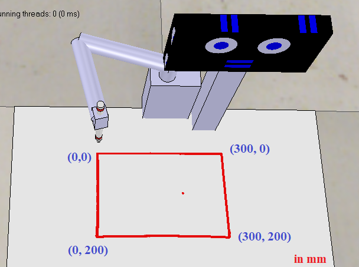

### kiddo: A robot for child education..   

This code works with the vrep model 'kiddobot_dynamixel_real_v2.ttt'  

### How to start
* Clone this repository.
* Install <a href="https://www.coppeliarobotics.com/downloads" target="_blank">VREP</a> EDU version.  
* run the "auto_kiddobot.ipynb" file.

### autokiddobot api  
Variables:  
    * x,y  : last pen coordinate. set by the get_current_xy() function.   
    * xmax, ymax  : range in x axis and y axis. Fixed value.  (300, 200) 
Functions:  
    * start(): connect with VREP and start simulation. Make sure the model is loaded in VREP beforehand. 
    * get_current_xy()  : read pen position. returns (x,y) 
    * go_to_xy(x, y)  : move pen position to (x,y) position. 
    * pen_down() : as it said. 
    * pen_up() : as it said. 
    * close() : close simulation in VREP.  

Dept. of CSE,North East University Bangladesh.  
